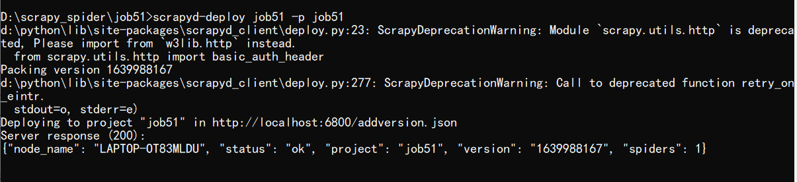

>scrapyd部署scrapy项目

安装scrapyd和scrapyd-client
```shell
pip install scrapyd　
pip install scrapyd-client
```

配置scrapy.cfg
```text
[settings]
default = job51.settings
 
[deploy:job51]#发布名称
url = http://localhost:6800/　#项目发布到那个地址
project = job51#项目名称
```
发布项目,首先输入以下命令：
```shell script
scrapyd
```
得到以下结果：



发布项目：

```shell
scrapyd-deploy job51 -p job51
```


爬虫调度：


### 部署SpiderKeeper

``` 
pip install spiderkeeper
```

启动spiderkeeeper

```
spiderkeeeper
```


在浏览器打开 localhost:5000

```text
默认用户名：admin
默认密码：admin
```


